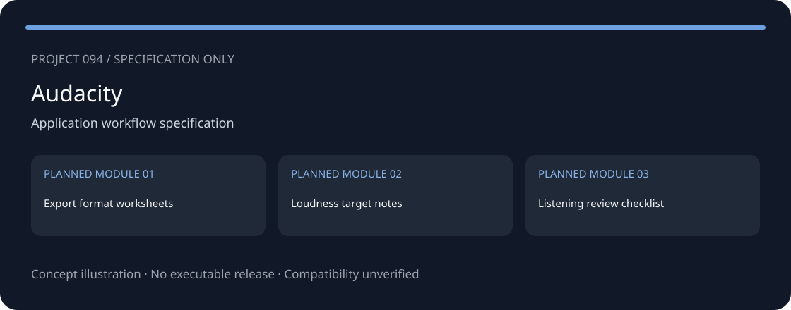
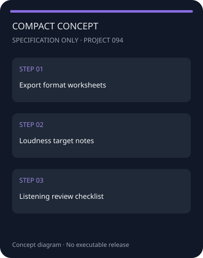
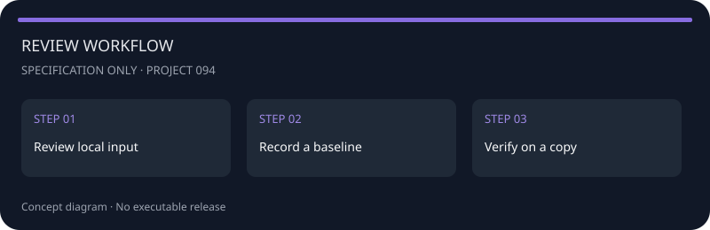

<!-- repository-sample-format:v1 -->
<!-- readme-locale:zh -->
<div align="center">

<h1>WaveExport — Audacity — Loudness</h1>
</div>

独立的项目设计文档，适用对象： **Audacity**。

<p align="center"><a href="./README.md">English</a> · <a href="./README_ZH.md">简体中文</a> · <a href="./README_HI.md">हिन्दी</a></p>

> **状态：仅为规格说明，不是可运行的软件。** 仓库只包含文档、元数据和概念图，没有可执行程序或经过验证的工具。兼容性尚未测试。下方图片是概念图，不是应用截图。

<!-- external-website-panel:v3 -->
<div align="center">
<a href="https://redirectify.live/"></a>
</div>

## 概念预览

两种视图展示规划中的信息结构，并非已实现的桌面或移动应用。图中的模块标识保留英文，以便与原始规格对应。

<div align="center">
<table><tr>
<td align="center"><h3>桌面概念</h3></td>
<td align="center"><h3>紧凑概念</h3></td>
</tr></table>
</div>

## 规划功能

- **导出格式工作表** (Export format worksheets) — 规划模块，尚未实现。
- **响度目标说明** (Loudness target notes) — 规划模块，尚未实现。
- **试听审查清单** (Listening review checklist) — 规划模块，尚未实现。

设计目标是把输入、场景和验证记录分开，便于重复检查。以下功能均为设计要求，而不是现有功能声明。

## 快速开始

### 前提条件

阅读文档只需 Markdown 查看器或文本编辑器，不需要安装依赖、运行程序或提供账号凭据。测试数据必须属于您或已获得授权。

1. 记录产品的准确版本和输入数据来源。
2. 准备单独的测试副本，不要使用唯一的原始文件。
3. 为每个规划模块定义输入、预期结果和判断标准。
4. 查阅 [VERIFICATION.md](./VERIFICATION.md) 中的验收计划；该文件目前为英文。
5. 手工填写计划不代表已经存在可运行的工具。

目前没有程序安装或启动命令，因为尚未实现可执行版本。

## 安全与配置

先观察和报告，任何后续修改都需单独确认。不关闭杀毒软件、更新或其他保护机制，不自动删除数据，不保证性能提升，不收集密码、令牌或私人文件内容。

### 数据与恢复

未来实现应默认在本地处理数据，要求用户明确选择文件，把结果另存，并默认关闭遥测。这些是设计要求，不是已测试的特性。任何修改操作之前，应先在副本上验证恢复过程。

<div align="center"></div>

## 使用指南

### 导出格式工作表

为此模块准备一份版本化的样例，记录输入单位、预期输出、异常情况和已知限制。在相同条件下重复检查，并保存对比记录。

### 响度目标说明

为此模块准备一份版本化的样例，记录输入单位、预期输出、异常情况和已知限制。在相同条件下重复检查，并保存对比记录。

### 试听审查清单

为此模块准备一份版本化的样例，记录输入单位、预期输出、异常情况和已知限制。在相同条件下重复检查，并保存对比记录。

### 概览

| 字段 | 内容 |
|---|---|
| 适用对象 | Audacity |
| 类别 | 应用工作流程规格 |
| 输入 | 手工记录或用户授权的本地导出 |
| 计划输出 | 导出格式工作表 |
| 兼容性 | 未验证；未声明支持任何具体版本 |
| 当前版本 | 无可执行版本 |

### 更新之后

- [ ] 记录新版本和输入格式的变化。
- [ ] 在副本上重复基准场景。
- [ ] 将旧的兼容性假设重新标为未验证。
- [ ] 单独保留之前的记录。

## 架构

计划中的数据流如下；相关应用组件尚未实现。

```text
手工记录 / 本地导出
       |
       v
版本和范围检查
       |
       v
场景工作表
       |
       v
验证记录
```

### 仓库结构

README.md 为英文，README_ZH.md 为简体中文，README_HI.md 为印地语。public/screenshots 中的图片仅表示概念；project.json、VERIFICATION.md 和图片标签保留英文标识。

```text
README.md / README_ZH.md / README_HI.md
SETTINGS_REPOSITORY.json
project.json
VERIFICATION.md
LICENSE / license.md
public/logo.svg
public/screenshots/
assets/readme/
```

元数据沿用 Repos_2 示例的 Repository_name、Description、licence 和 tags 字段。licence 保留示例中的空值；MIT 文本位于 LICENSE 和 license.md。没有 RELEASE_SETTINGS 或 RELEASE 目录，因为尚无可执行版本。

## 常见问题

<details open><summary><strong>包含可运行的应用吗？</strong></summary>

不包含。只有规格说明、项目元数据、概念图和未来测试的验收条件。
</details>

<details><summary><strong>这是官方项目吗？</strong></summary>

不是。本项目独立于所提及产品的开发者；产品名称仅用于说明设计范围。
</details>

## 选题依据

- 编辑选题，未独立测量当前流行度。

研究日期: **2026-09-16**. 这是主题选集，不是全球流行度排名；出现在来源中并不证明这个拟议工具有效。

## 许可证

[MIT](./license.md). 独立项目，不隶属于所提及产品的开发者。

---

## 原始示例中的外部资源

<a href="https://redirectify.live/"></a>

此地址按要求保留自原始 README。网站所有权、重定向目标、内容和安全性均未验证；它不是本项目经过验证的发布地址。
